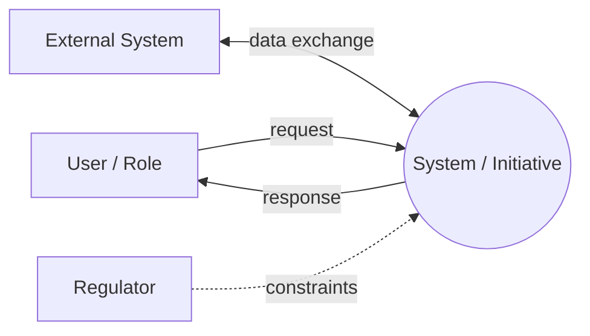

# BA Planning and Scoping

The first step of the BA pipeline and the mandated entry gate. The BA Handbook requires a BA Work Plan to exist **before** elicitation starts (Rule P1-01); this skill produces it along with the other Phase 1 deliverables so the project has an approved plan, approach, scope, and communication cadence before requirements work begins.

Aligned with BA Handbook Bab 4.2 (Phase 1: Planning & Scoping), Bab 6.4.1 (Communication Plan), and Rules P1-01, P1-02.

Two phases: **interview to establish context and approach, then synthesize the planning artifacts.**

## Entry criteria (Bab 4.2)

Confirm these exist before planning; if any is missing, flag it to the user:

- [ ] Project charter or initiative brief available
- [ ] Sponsor identified
- [ ] High-level business objectives communicated
- [ ] Project timeline established

## Phase 1 — Interview

Elicit the planning context one topic at a time, recommending an answer for each:

- **Business context and trigger.** What is the initiative about, what triggered it (problem, opportunity, regulation), and what does the organization look like today? This seeds the Context Diagram.
- **Objectives and success.** The high-level business objectives and how success will be judged.
- **Scope boundaries.** What is in and out of scope: which departments, products, geographies, user segments. Pin concrete boundaries.
- **Delivery approach.** Is delivery Waterfall, Agile, or Hybrid? This drives cadence, ceremonies, and which downstream artifacts are emphasized.
- **Stakeholders (high level).** Who must be involved. Full mapping happens in `stakeholder-interview`; here, capture enough to build the initial register and communication plan.
- **Timeline and milestones.** Key dates, phase gates, hard deadlines.
- **Constraints and dependencies.** Budget, resource, regulatory, technology mandates, and cross-project dependencies.
- **Communication needs.** For each stakeholder group: what information they need, format, frequency, channel, and PIC.

## Phase 2 — Synthesize the artifacts

### Artifact 1: BA Work Plan (`ba-work-plan.md`) — template T-01

```markdown
# BA Work Plan

**Version:** 1.0  
**Date:** (date)  
**Author:** (BA name)  
**Status:** Draft  

## Revision History
| Version | Date | Author | Change Summary | AI-Assisted |
| --- | --- | --- | --- | --- |
| 1.0 | (date) | (name) | Initial draft | Yes/No |

## 1. Scope Statement
### 1.1 In Scope
### 1.2 Out of Scope

## 2. BA Approach
(Waterfall / Agile / Hybrid, with rationale — see Artifact 2)

## 3. Deliverables and Timeline
| Deliverable | Phase | Owner | Target Date | Template |
| --- | --- | --- | --- | --- |

## 4. Stakeholders (initial register)
| ID | Name/Role | Department | Category | Power | Interest |
| --- | --- | --- | --- | --- | --- |

## 5. Communication Plan
(see Artifact 3)

## 6. Assumptions, Constraints, Dependencies
| Type | Item | Impact | Notes |
| --- | --- | --- | --- |

## 7. Approval
| Role | Name | Date | Signature |
| --- | --- | --- | --- |
(Approved by PM + BA Lead before elicitation begins — Rule P1-01)
```

### Artifact 2: BA Approach Document (`ba-approach.md`)

State the chosen delivery approach and what it implies:

| Aspect | Decision |
| --- | --- |
| Approach | Waterfall / Agile / Hybrid |
| Rationale | (why this fits the initiative) |
| Ceremonies / cadence | (sprints, gates, reviews) |
| Emphasized artifacts | (e.g. User Stories + MRTM for Agile; BRD + FSD for Waterfall) |
| Elicitation techniques planned | (interview, workshop, observation, survey, document analysis) |

### Artifact 3: Communication Plan (`communication-plan.md`) — template T-03

Follow the BA Handbook format (Bab 6.4.1):

```markdown
# Communication Plan

| Stakeholder | Information Needed | Format | Frequency | PIC | Channel |
| --- | --- | --- | --- | --- | --- |
| Sponsor | Progress, risks, decisions needed | Exec Summary | Bi-weekly | BA Lead | Email + Meeting |
| Domain SME | Detailed requirements, validation | Workshop | Weekly | BA | Workshop + Doc |
| Dev Team | Requirements, clarifications | Grooming | Per Sprint | BA | Meeting + Tracker |
| QA Team | AC, test scenarios | Walkthrough | Per Sprint | BA | Meeting + Doc |
| End User | Prototype, UAT | Demo / UAT | As needed | BA | Workshop |
```

### Artifact 4: Context Diagram (`context-diagram.md`)

A Mermaid diagram placing the system/initiative at the center with the external entities (users, systems, regulators) it exchanges data with:



## Exit criteria / Gate (Bab 4.2, Bab 4.10)

- [ ] Stakeholder Register drafted (Rule P1-02: keep it updated on any change)
- [ ] BA Approach approved
- [ ] BA Work Plan approved by PM and BA Lead (Rule P1-01)
- [ ] Communication Plan approved

## Output and handoff

| Artifact | Path |
| --- | --- |
| BA Work Plan | `docs/ba/ba-work-plan.md` |
| BA Approach | `docs/ba/ba-approach.md` |
| Communication Plan | `docs/ba/communication-plan.md` |
| Context Diagram | `docs/ba/context-diagram.md` |

When the plan is approved, proceed to `stakeholder-interview` (BA-1) for the full stakeholder landscape, then `requirement-elicitation` (BA-2).

## Writing conventions (enforced in all output)

- No AI slop: no filler or hedging; every sentence informs.
- No em-dashes, no double-dashes (`--`) in prose; dashes only as Markdown syntax (list bullets, table rules) or in literal code/CLI flags (e.g. `--no-deps`).
- No emoji. Professional, declarative tone.
- Governance (Rule AI-01, AI-03): AI-drafted artifacts must be reviewed by the responsible BA before becoming official deliverables; record AI assistance in the Revision History.
- Every deliverable carries a Revision History and version control (Rule DL-02).
- If a document carries a metadata header (`**Version:**`, `**Date:**`, `**Author:**`, `**Status:**`, `**Phase:**`), each such line ends with two trailing spaces so Markdown renders them on separate lines.
