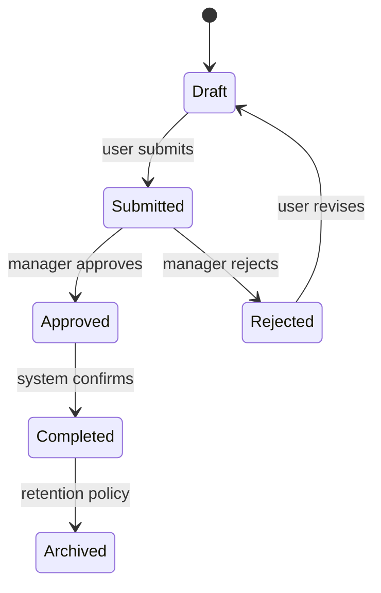
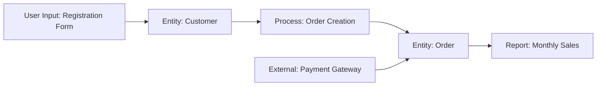

# Data Dictionary

The seventh step in the BA pipeline. Establishes the single source of truth for what the business's data means, who owns it, and where it flows. The technical `technical-spec` skill later translates this into a database schema, but the business definitions live here and take precedence when the two conflict.

Two phases: **elicit the data landscape, then synthesize the dictionary and glossary.**

## Phase 1 — Elicit

Read existing artifacts: `docs/ba/brd.md`, `docs/ba/field-specs/`, `docs/ba/process-map-to-be.md`, `docs/ba/business-rules.md` if they exist. The field specs are the richest source: every field on every screen references a data entity and attribute.

Interview the user entity by entity. For each entity:

- **Entity name.** The business name (not the database table name). If the business uses a non-English term (e.g. "Pelanggan" for Customer), capture both.
- **Definition.** What is this thing in business terms? One or two sentences. Avoid circular definitions ("A customer is a customer record").
- **Lifecycle.** What states does this entity move through? (e.g. Draft > Submitted > Approved > Completed > Archived). For each state: what triggers the transition, who can trigger it, and is the transition reversible?
- **Owner.** Which department or role is the authoritative source for this entity's data?
- **Volume.** Roughly how many of these exist today, and how fast is that growing?
- **Retention.** How long must this data be kept? Any regulatory requirements?

For each attribute of each entity:

- **Attribute name.** The business name.
- **Definition.** What does this attribute mean? (Not "the name field" but "the legal name as it appears on the business registration document".)
- **Data type (business).** Text, number, currency, date, yes/no, choice from list, etc. Not SQL types.
- **Domain/allowed values.** The set of valid values or the valid range.
- **Required?** Is this attribute always present, or only in certain states or contexts?
- **Source.** Where does this value come from? (User input, calculated, imported from system X, derived from attribute Y.)
- **Business rules.** Any rules that govern this attribute (cross-reference `RULE-XX` from the business rules catalog).
- **Sensitivity.** Is this PII, financial, health, or otherwise sensitive? Drives security and compliance decisions downstream.

For relationships between entities:

- **Relationship.** Entity A [has many / belongs to / is associated with] Entity B.
- **Cardinality.** One-to-one, one-to-many, many-to-many.
- **Business meaning.** Why does this relationship exist? What does it represent in the real world?
- **Cascade behavior (business).** What happens to B when A is deleted or archived? (Business rule, not database config.)

## Phase 2 — Synthesize

### Artifact 1: Data Dictionary (`data-dictionary.md`)

```markdown
# Business Data Dictionary

**Version:** 1.0  
**Date:** (date)  
**Author:** (BA name)  
**Status:** Draft  

## Entity: (Entity Name) (UI label: "(localized name)")

**Definition:** (business definition)  
**Owner:** (department/role)  
**Lifecycle:** (state1) > (state2) > (state3)  
**Volume:** ~(count), growing (rate)  
**Retention:** (policy)  

### Attributes

| Attribute | Definition | Type | Domain | Required | Source | Rules | Sensitivity |
| --- | --- | --- | --- | --- | --- | --- | --- |
| (name) | (meaning) | (business type) | (values/range) | Yes/No/Conditional | (source) | RULE-XX | PII/Financial/None |

### Relationships

| Related Entity | Relationship | Cardinality | Meaning | Cascade |
| --- | --- | --- | --- | --- |
| (entity) | has many / belongs to | 1:N | (why) | (behavior) |

### State Machine

(Mermaid state diagram)


```

### Artifact 2: Business Glossary (`glossary.md`)

An alphabetical glossary of every business term used in the project. Each entry:

```
| Term | Definition | Synonyms | Context | See Also |
| --- | --- | --- | --- | --- |
| (term) | (definition) | (other names used) | (where this term appears) | (related terms) |
```

Include non-English terms with their English equivalent if the project is multilingual. This glossary feeds directly into `GLOSSARY.md` in the Tech Lead pipeline.

### Artifact 3: Data Lineage Map (`data-lineage.md`)

A Mermaid diagram showing where data originates, how it transforms, and where it flows:



Below the diagram, a lineage table:

```
| Data Element | Source | Transformations | Destinations | Update Frequency |
| --- | --- | --- | --- | --- |
| (element) | (origin) | (calculations, mappings) | (where it goes) | (real-time/batch/manual) |
```

## Output

| Artifact | Path |
| --- | --- |
| Data dictionary | `docs/ba/data-dictionary.md` |
| Business glossary | `docs/ba/glossary.md` |
| Data lineage | `docs/ba/data-lineage.md` |

## Handoff

When the user is satisfied, point them at:
- `ba-handoff` to compile the complete BA package
- The Tech Lead pipeline's `technical-spec` skill will consume this dictionary when designing the database schema
- `GLOSSARY.md` (from `project-docs`) should mirror or extend this glossary

## Writing conventions (enforced in all output)

- No AI slop: no filler or hedging; every sentence informs.
- No em-dashes, no double-dashes (`--`) in prose; dashes only as Markdown syntax (list bullets, table rules) or in literal code/CLI flags (e.g. `--no-deps`).
- No emoji. Professional, declarative tone.
- Preserve domain terms and non-English labels verbatim. Mirror both the business name and the localized UI label where they differ.
- If a document carries a metadata header (`**Version:**`, `**Date:**`, `**Author:**`, `**Status:**`, `**Phase:**`), each such line ends with two trailing spaces so Markdown renders them on separate lines.
