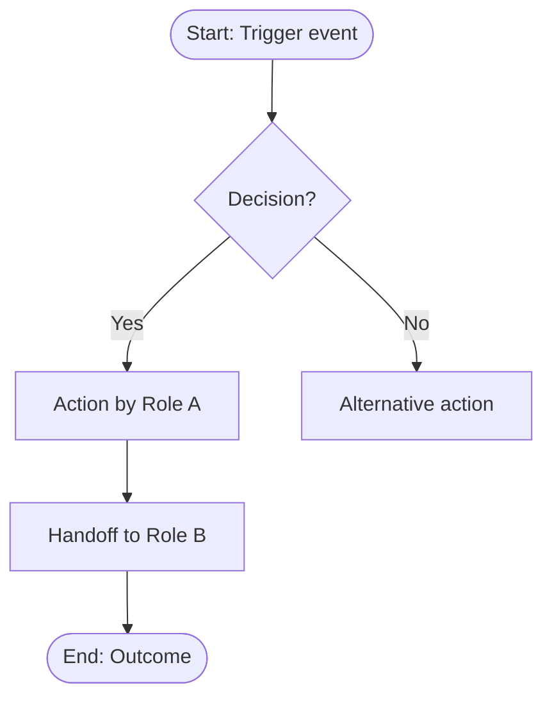

# Process Mapping

The third step in the BA pipeline. Takes the business requirements and stakeholder context and turns them into visual process flows. The gap between AS-IS and TO-BE is where the project's real value lives; this skill makes that gap explicit and measurable.

Aligned with BA Handbook Bab 4.4 (Analysis), Bab 10.4.1 (BPMN), and Bab 12 (Visual Guide). Process diagrams use Mermaid flowcharts following BPMN-equivalent conventions (see notation guide below).

Three phases: **map the current state, design the future state, then analyze the gap.**

## Mermaid notation guide (BPMN-equivalent)

All process diagrams in this skill use Mermaid flowcharts. To maintain compliance with BA Handbook BPMN standards, every diagram must follow these conventions:

| BPMN Element | Mermaid Syntax | Example |
| --- | --- | --- |
| Start Event | `([Start: trigger])` | Stadium-shaped node |
| End Event | `([End: outcome])` | Stadium-shaped node |
| Task / Activity | `[Action by Role]` | Rectangle node |
| XOR Gateway (exclusive) | `{Decision?}` | Rhombus node, one path taken |
| AND Gateway (parallel) | Use `fork` and `join` labels | Fork into parallel paths, join back |
| OR Gateway (inclusive) | `{Check conditions}` with multiple Yes edges | One or more paths taken |
| Pool / Lane (role boundary) | `subgraph RoleName` | Groups steps by actor |
| Sequence Flow | `-->` | Solid arrow |
| Message Flow (cross-pool) | `-.->` | Dotted arrow |
| Data Object | `[(Document name)]` | Cylindrical or note shape |

**Minimum elements per diagram:** every process diagram must include at least: one start event, one end event, decision gateways where the process branches, and swimlanes (`subgraph`) when multiple actors are involved.

## Phase 1 — AS-IS (Current State)

Read existing artifacts first: `docs/ba/brd.md`, `docs/ba/interview-notes.md`, `docs/ba/pain-points-register.md` if they exist.

Interview the user to walk through the current process, one step at a time. For each process:

- **Process name and purpose.** What does this process accomplish? When does it start and end?
- **Actors.** Who performs each step? Use roles, not individual names. Map to stakeholder IDs where possible.
- **Steps.** Walk through the process chronologically. For each step:
  - What action is performed?
  - What input does this step need?
  - What output does it produce?
  - What system or tool is used (if any)?
  - How long does this step typically take?
  - What can go wrong? (error paths, exceptions)
- **Decision points.** Where does the process branch? What conditions determine which path is taken?
- **Handoffs.** Where does work transfer between roles or departments? These are friction points by nature.
- **Pain points.** Mark steps that are manual, slow, error-prone, or redundant. Cross-reference the pain-points register.

Produce a Mermaid flowchart for each process using the notation guide above:



Use swimlanes (`subgraph`) to show role boundaries when multiple actors are involved.

### Process metrics (AS-IS)

For each process, capture baseline metrics where the user can provide them:

```
| Metric | Value | Source |
| --- | --- | --- |
| Average cycle time | (duration) | (how measured) |
| Volume per period | (count) | (how measured) |
| Error/rework rate | (percentage) | (how measured) |
| Manual steps | (count of total) | (from map) |
| Handoff count | (count) | (from map) |
```

## Phase 2 — TO-BE (Future State)

Design the future process based on the BRD requirements. For each AS-IS process:

- Which steps are eliminated?
- Which steps are automated?
- Which steps are combined?
- What new steps are introduced?
- How do handoffs change?
- What new decision logic applies?

Produce a TO-BE Mermaid flowchart in the same format. Highlight changes from AS-IS using node styling:

- Green-styled nodes for new steps
- Red-styled nodes for eliminated steps (shown with strikethrough in a legend, not in the diagram itself)
- Yellow-styled nodes for modified steps

Capture target metrics:

```
| Metric | AS-IS | TO-BE Target | Improvement |
| --- | --- | --- | --- |
| Average cycle time | (current) | (target) | (delta) |
| Manual steps | (current) | (target) | (delta) |
```

## Phase 3 — Gap Analysis

For each process, produce a structured gap analysis:

```
| ID | AS-IS State | TO-BE State | Gap Type | Enabling Requirement | Complexity | Priority |
| --- | --- | --- | --- | --- | --- | --- |
| GAP-01 | (current) | (desired) | Process/Technology/People/Data | BR-XX | High/Med/Low | Must/Should/Could |
```

Gap types:
- **Process**: a workflow step changes, is added, or removed
- **Technology**: a system or tool must be introduced, replaced, or integrated
- **People**: roles, skills, or organizational structure must change
- **Data**: data must be captured, migrated, transformed, or retired

Each gap traces to the business requirement it fulfills. Gaps that are not covered by a requirement are flagged as scope creep or missing requirements (feed back to `requirement-elicitation`).

## Output

Write three files:

| Artifact | Path |
| --- | --- |
| AS-IS process maps | `docs/ba/process-map-as-is.md` |
| TO-BE process maps | `docs/ba/process-map-to-be.md` |
| Gap analysis | `docs/ba/gap-analysis.md` |

## Handoff

When the user is satisfied, point them at:
- `impact-analysis` to assess the organizational and system impact of the gaps identified
- `ba-grooming` to validate that user stories cover every gap
- `wireframe-spec` if TO-BE processes imply new screens or UI changes

## Writing conventions (enforced in all output)

- No AI slop: no filler or hedging; every sentence informs.
- No em-dashes, no double-dashes (`--`) in prose; dashes only as Markdown syntax (list bullets, table rules) or in literal code/CLI flags (e.g. `--no-deps`).
- No emoji. Professional, declarative tone.
- If a document carries a metadata header (`**Version:**`, `**Date:**`, `**Author:**`, `**Status:**`, `**Phase:**`), each such line ends with two trailing spaces so Markdown renders them on separate lines.
