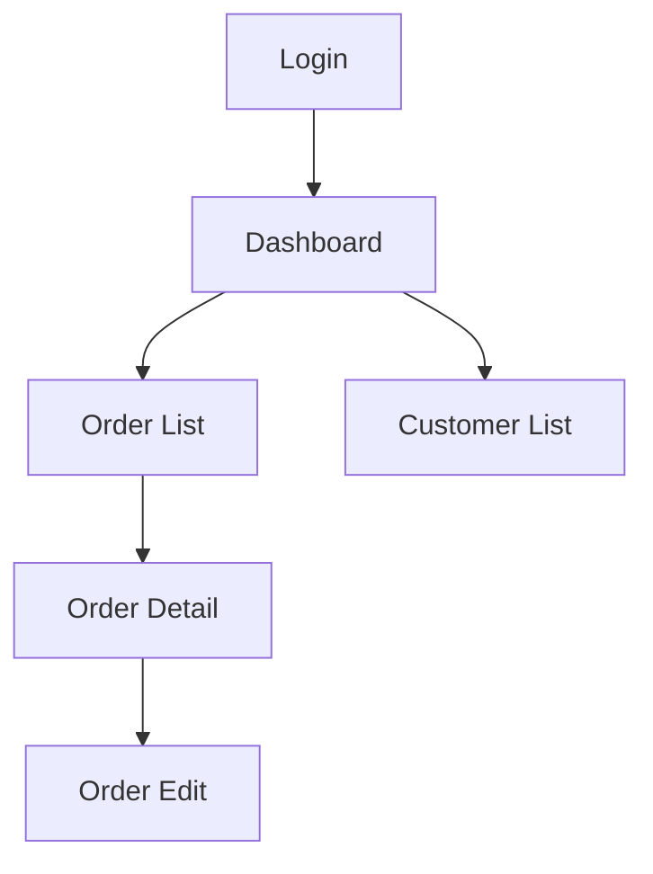

# Wireframe Spec

The sixth step in the BA pipeline. Translates business requirements and process maps into a screen-level specification that designers and developers can build from. This is not a visual wireframe tool; it produces the structured specification that describes what each screen must contain, what each field requires, and how users navigate between screens.

Three deliverables: **screen inventory, navigation flow, and field-level specifications.**

## Input

Read existing artifacts: `docs/ba/brd.md`, `docs/ba/process-map-to-be.md`, `docs/ba/stakeholder-map.md`, and `docs/business/user-story.md` if they exist. The TO-BE process map is the primary driver: each human-facing step in the process implies a screen or a screen state.

## Phase 1 — Screen Inventory

Interview the user to walk through the application screen by screen. For each screen:

- **Screen ID** (`SCR-XX`)
- **Screen name** (the name a user would recognize)
- **Purpose**: what the user accomplishes here (one sentence)
- **Persona(s)**: which roles access this screen
- **Entry points**: how the user arrives (navigation, link, redirect, notification)
- **Exit points**: where the user can go from here
- **Related US/AC**: which user stories this screen serves
- **Related process step**: which TO-BE process step this screen implements

Produce a screen inventory table:

```
| ID | Screen Name | Purpose | Persona(s) | Related US | Process Step |
| --- | --- | --- | --- | --- | --- |
| SCR-01 | (name) | (purpose) | (roles) | US-XX | (step) |
```

Group screens by functional area or user journey.

## Phase 2 — Navigation Flow

Produce a Mermaid diagram showing how screens connect:



Use swimlanes (`subgraph`) to group screens by functional area. Annotate edges with the user action that triggers navigation (e.g., "clicks 'New Order'").

For role-based navigation differences, produce separate flows or annotate which paths are available to which personas.

## Phase 3 — Field-Level Specifications

For each screen, produce a detailed field specification. This is the core deliverable: the field spec is the contract between BA, designer, and developer.

### Per-screen spec structure

```markdown
## SCR-XX — (Screen Name)

**Purpose:** (what the user does here)  
**Persona:** (roles)  
**Layout type:** Form / List / Dashboard / Detail / Modal / Wizard step  

### Data displayed

| Field | Label (UI) | Type | Source | Notes |
| --- | --- | --- | --- | --- |
| (field) | (user-facing label) | Text/Number/Date/Dropdown/... | (entity.attribute or computed) | |

### User inputs

| Field | Label (UI) | Type | Required | Validation | Default | Placeholder | Help Text |
| --- | --- | --- | --- | --- | --- | --- | --- |
| (field) | (label) | Text/Number/Date/Select/Multi-select/File/Toggle | Yes/No | (rules) | (value) | (hint) | (explanation) |

### Actions

| Action | Label (UI) | Type | Behavior | Confirmation | Permission |
| --- | --- | --- | --- | --- | --- |
| (action) | (button text) | Primary/Secondary/Danger/Link | (what happens) | Yes/No + message | (role) |

### States

| State | Condition | Display Change |
| --- | --- | --- |
| Empty | (no data) | (what the user sees) |
| Loading | (data fetching) | (skeleton/spinner) |
| Error | (API failure) | (error message) |
| Success | (action completed) | (confirmation) |
| No permission | (unauthorized) | (access denied message) |

### Business rules on this screen

| Rule ID | Rule | Behavior |
| --- | --- | --- |
| RULE-XX | (from business rules catalog) | (how it manifests on this screen) |
```

### Validation rules

Write validation rules in business language, not regex:
- "Must be a valid email address"
- "Must be between 1 and 999,999"
- "Must be a date in the future"
- "Must match a value in the product catalog"

For conditional validations, state the condition: "Required only when order type is 'International'".

## Output

| Artifact | Path |
| --- | --- |
| Screen inventory | `docs/ba/screen-inventory.md` |
| Navigation flow | `docs/ba/navigation-flow.md` |
| Field specs per functional area | `docs/ba/field-specs/(area).md` |

## Handoff

When the user is satisfied, point them at:
- `data-dictionary` to formalize the data entities referenced in the field specs
- `ba-handoff` to compile everything for engineering
- The designer (human) to turn these specs into visual wireframes and mockups

## Writing conventions (enforced in all output)

- No AI slop: no filler or hedging; every sentence informs.
- No em-dashes, no double-dashes (`--`) in prose; dashes only as Markdown syntax (list bullets, table rules) or in literal code/CLI flags (e.g. `--no-deps`).
- No emoji. Professional, declarative tone.
- Preserve the user's domain terms and any non-English labels verbatim. If the UI will be in Bahasa Indonesia, field labels are in Bahasa Indonesia.
- If a document carries a metadata header (`**Version:**`, `**Date:**`, `**Author:**`, `**Status:**`, `**Phase:**`), each such line ends with two trailing spaces so Markdown renders them on separate lines.
